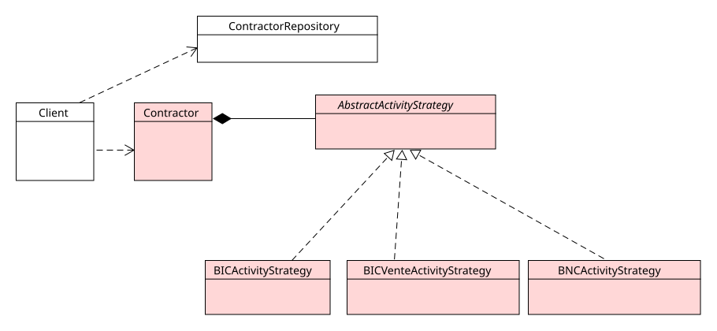

# Proposition

- [Proposition](#proposition)
  - [Installer le projet](#installer-le-projet)
    - [Prérequis](#prérequis)
    - [Installer localement](#installer-localement)
    - [Installer globalement](#installer-globalement)
  - [Usage](#usage)
  - [Questions](#questions)

## Installer le projet

### Prérequis

Installer `php8+`, `sqlite` et activer le module `pdo_sqlite`.

Vérifier :

~~~bash
php -v
PHP 8.5.6 (cli) (built: May 14 2026 15:48:47) (NTS)
Copyright (c) The PHP Group
Built by Debian
Zend Engine v4.5.6, Copyright (c) Zend Technologies
    with Zend OPcache v8.5.6, Copyright (c), by Zend Technologies
php -m | grep pdo_sqlite
pdo_sqlite
sqlite3 --version
3.40.1 2022-12-28 14:03:47 df5c253c0b3dd24916e4ec7cf77d3db5294cc9fd45ae7b9c5e82ad8197f3alt1
~~~

### Installer localement

~~~bash
composer install
php urssafc.php
~~~

### Installer globalement

Placer le script `urssafc.php` sur votre `PATH`, par exemple :

~~~bash
cp urssafc.php /usr/bin/urssafc
chmod +x /usr/bin/urssafc
urssafc
~~~

## Usage

Afficher la documentation

~~~bash
urssafc
~~~

~~~bash
#Enregistrer des autoentreprises
urssafc add "John Incubator Jones" 18812369758410 bic-vente ps

#Lister
urssafc ls
1 John Incubator Jones 18812369758410 bic-vente ps
Total: 1

#Simulation d'une déclaration mensuelle
urssafc dry-declare 1 3235
John Incubator Jones - BIC(Vente) | Prélèvement à la source
CA HT mensuel:           3235 EUROS
Aide spécifique:          200 EUROS
Cotisations sociales:  711,70 EUROS
Revenu imposable:      938,15 EUROS
CA TTC mensuel:       2523,30 EUROS
~~~

## Questions

> Voir les commentaires placés dans les sources pour d'autres remarques.

**Répondez** de manière *succincte* aux questions suivantes :

1. En quoi votre système respecte [l'*Open Close Principle*](https://en.wikipedia.org/wiki/Open%E2%80%93closed_principle) (ouvert à l'extension, fermé à la modification) ?

Il est possible de **modifier le métier** (régimes d'activité, régimes fiscaux, détails sur les microentreprises) **sans modifier le code client** (fermé à la modification). Ici, le code client dépend uniquement de la classe `Contractor` et de sa méthode `buildReport()`, méthode *passe-plat* qui délègue le travail vers une implémentation de l'interface fournie par la classe `AbstractActivityStrategy`   :

~~~php
echo $contractor->buildReport($caHt);
~~~

Le système est donc ouvert à l'extension mais fermé à la modification. Par exemple, pour ajouter/supprimer un nouveau régime d'activité il suffit de créer/supprimer une nouvelle classe sans changer le reste du système. Tout modification sur le métier est contrôlée. Chaque régime d'activité dispose d'une interface commune et de sa propre logique métier.

> Remarque : il y a encore des petites choses à faire pour améliorer le design et le faire adhérer encore davantage au principe, notamment sur la gestion des régimes fiscaux et la génération des rapports. On peut *toujours* améliorer un design, refactoriser, trouver de nouvelles abstractions, etc.. Il faut aussi *savoir s'arrêter*, laisser le système simple et ne pas trop anticiper le futur. C'est un délicat numéro d'équilibriste.

2. *Pourquoi* utilisons-nous un *design pattern* (*Stratégie*) ici ? **Justifier** d'après les spécifications et le contexte métier.

Les spécifications du projet indiquent *La législation, les régimes d'activité et régimes fiscaux et les taux appliqués **sont amenés à changer** dans le futur.* Les règles métiers de cotisation, régimes fiscaux et d'activité évoluent souvent en fonction des gouvernements, législations, etc. Cela justifie de vouloir bien *isoler* ces modules pour que les changement à leur apporter aient **le moins d'impact possible sur le reste du système**. Les besoins, le métier justifie donc que l'on introduise ici suffisamment d'abstractions pour réaliser un *couplage faible*.

> Découpler, contrôler les dépendances via des Design Patterns **a un coût** : l'introduction de nouvelles abstractions, orientées "système" et non métier. Cela signifie plus de classes/interfaces, plus de code et peut nuire à la lisibilité de la codebase. Il faut arriver à un **compromis** : est-ce que ça vaut le coup **de payer ce prix** ? Rapport avantages/désavantages ? Ici, on me dit que les règles de gestion **vont évoluer**, le prix à payer est très largement acceptable pour les bénéfices apportés.

Le design pattern *Strategy* est un design pattern de base pour *découpler le client de son implémentation* : on programme *vers une interface* pour mettre en place [une inversion de dépendance](https://fr.wikipedia.org/wiki/Inversion_des_d%C3%A9pendances) et on *compose* le client (`Contractor`) avec sa stratégie au *runtime*, en l'injectant via son constructeur (injection de dépendances) :

~~~php
// Résolution de la stratégie selon l'activité stockée en BDD (le "switch")
$strategy = match ($row['activity']) {
    'bnc' => new BNCActivityStrategy(),
    'bic' => new BICActivityStrategy(),
    'bic-vente' => new BICVenteActivityStrategy(),
    default => throw new Exception("Régime d'activité inconnu : {$row['activity']}"),
};

//Injection de la stratégie via le constructeur 
return new Contractor(
    ...,
    $strategy
);
~~~

3. Pourquoi est-il important que votre *Domain* ou *Model* (le code métier, contenu du dossier `src` ou `src/Model`) reste **indépendant** ? Serait-il facilement réutilisable pour développer une version web de l'application ?

Le modèle ne doit jamais dépendre de modules propres aux implémentations (couches externes), il doit être *dependable* : le reste du système *doit dépendre* de *lui*. Il doit rester indépendant de tout *contexte* d'utilisation, par exemple de votre framework web favori du moment, de votre ORM préféré ou de votre choix de persistance (type de base de données, SGBDR, système de fichiers, service externe, etc.). **Le modèle peut facilement être réutilisé pour proposer une application web**. Il suffit d'**importer** le contenu de `src/Model` et du `Repository` dans une autre application. **Les deux applications, CLI et web, utilisent le même code**, sans aucun changement à apporter.

4. **Réaliser** un **diagramme de classes UML** du système. Le script CLI apparaîtra sous la classe `Client`. **Indiquer** avec un schéma de couleur les classes/interfaces participantes au pattern *Strategy*. On ne fera apparaître que les classes/interfaces participantes avec leurs noms et leurs associations (pas les méthodes, ni les attributs). Pour cela, **utiliser votre logiciel favori** ([Diagrams(web)](https://app.diagrams.net/), [Umlet](https://www.umlet.com/), à la main, etc.). **Publier** le diagramme sur le dépôt.

En rose, les classes participantes au Design Pattern *Strategy*.
